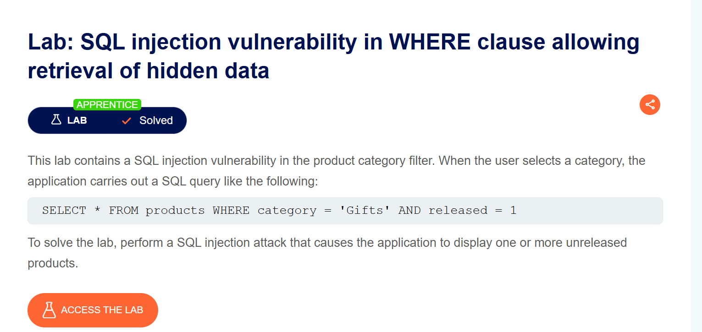

# Tổng quan về lab
đầu tiên ta truy cập vào lab1 và xem chức năng web như người dùng bình thường
Khi bấm vào ***Accessories*** ta vô tình thấy:
```Link
https://0aac000f030406dc8051357d000e0099.web-security-academy.net/filter?category=Gifts
```
Ở phần category=Gifts rất có mùi của lỗ hổng SQLi
Ta thử  `'` lúc này Internal Server Error chứng tỏ cho việc câu truy vấn SQL đến DB bị lỗi
Ta thử `'--` vào cuối url lúc này ta thấy rằng là Gifts'-- lúc này 
```SQL
SELECT * FROM products WHERE category = 'Gifts' AND released = 1
```
Lúc đó câu Query trở thành:
```SQL
SELECT * FROM products WHERE category = 'Gifts'--' AND released = 1
```
`--` là cú pháp comment trong SQL điều đó có nghĩa là `AND released = 1` bị biến thành comment 
Gifts hiện ra một sản phẩm mới chưa được release chứng tỏ là các sản phẩm ban đầu có released=1 sau khi ta dùng `'--` khiến phần released bị bỏ qua và hiện cả sản phẩm unreleased(Tức là released = 0)

=> 100% SQLi
Mục tiêu của lab là hiện ra sản phẩm chưa được released

# Khai Thác
-Đầu tiên ta thêm dấu `'` để đóng cái truy vấn 
-Thêm toán tử OR
-Thêm điều kiện luôn đúng 1=1
-Thêm `--` để comment những cái đằng sau không cho thực thi
Bản chất của việc này là toán tử A OR B chỉ cần một trong hai đúng lúc này cả A OR B sẽ ra giá trị đúng 
Dùng encode url bằng cách thêm dấu `+` vào các khoảng trắng

```Link
https://0aac000f030406dc8051357d000e0099.web-security-academy.net/filter?category=Gifts'+OR+1=1--
```

Lúc này truy vấn thành:
```SQL
SELECT * FROM products WHERE category = 'Gifts' OR 1=1 --' AND released = 1
```
=> LAB1 SOLVED
